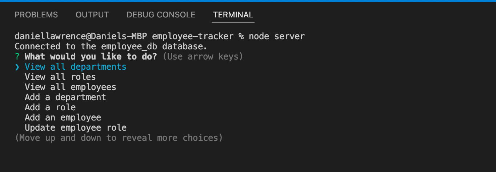
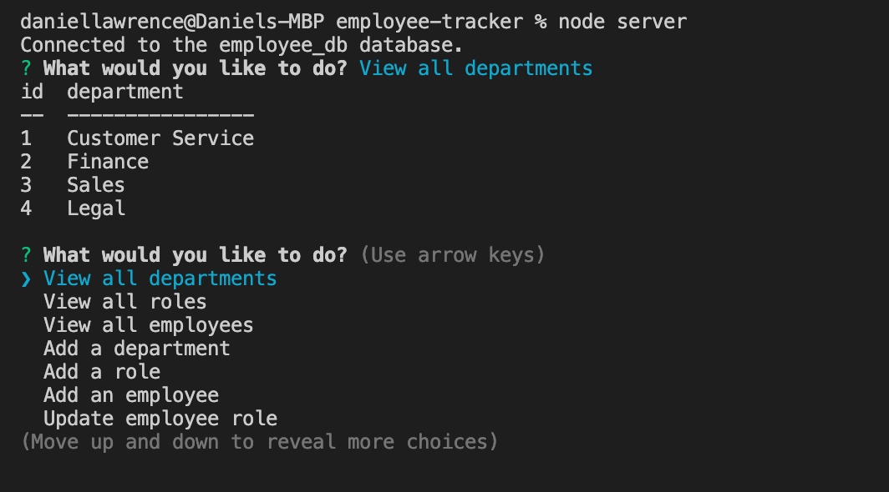
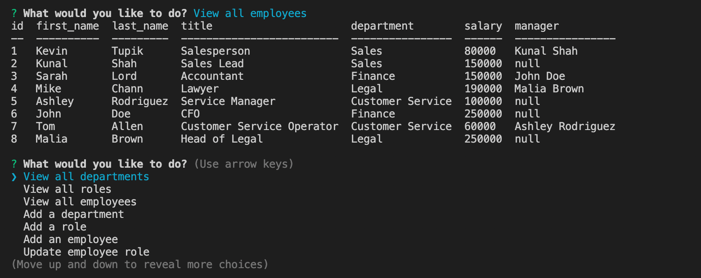
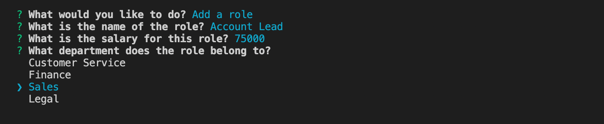
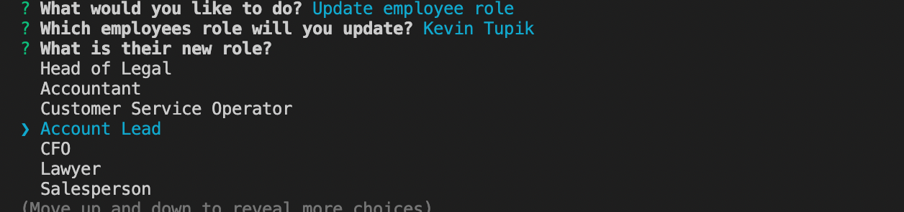

# Employee Tracker

## Description

This is a command line application that allows the user to view, add and update various functions regarding their employees, roles and departments.

## Installation

The repo will need to be forked from github, once this has been done run npm install to download the relevant dependencies. There is a .env.Example file that will need to be edited to a .env file with your own mysql username and password filled in. The file will need to be renamed .env as well. Once this has been done and the dependencies installed the project will work.

## Usage

Begin the project logging into the mysql shell and running the schema.sql file to create the database and tables. Then the project will be started by logging out of mysql and typing node server.js. This will bring you to a main menu which looks like the following:

Once the relelvant option has been chosen from the menu you will be taken to that section of the app and either shown the information requested, or given further prompts to add or edit information. Each time an option is chosen you will add or view the relevant data and then be taken back to the main menu where you can decided what to do next, or quit and end the server by selecting quit from the main menu.

This image shows the table shown if view all departments is chosen as an option.

This image shows the table shown if view all employees chosen which also includes joining the three tables in the schema.sql file to get the data for this table.

When adding a department, role or employee you are asked a series of prompts about the role to provide the information which will be given when an employee has that role.

This will then be displayed when carrying out other functions such as updating an employees role once a new role has been added.

There are various other functions available where you can delete a department, role, or employee or view employees by different criteria such as department or manager. These are covered in the walkthrough video.

## Walkthrough video

Please click this [link](link here for video) to watch a walkthrough video on how to use the application.

## Questions

If there are any questions regarding this project please visit my GitHub profile which has contact information - [DanLawrence91](https://github.com/DanLawrence91)
